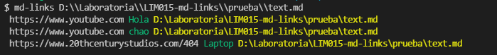
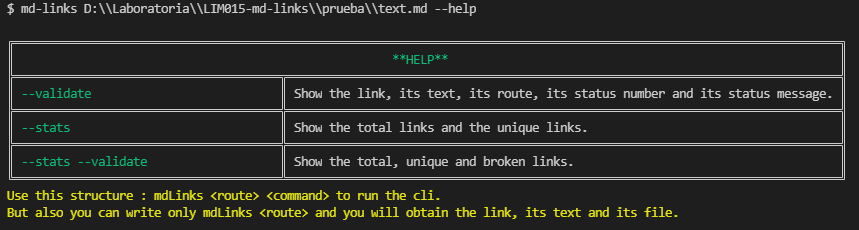

# MarkLink

## Índice

- [1. Resumen del proyecto](#1-resumen-del-proyecto)
- [2. Diagrama de Flujo](#2-diagrama-de-flujo)
- [3. Documentación técnica de la librería](#3-documentación-técnica-de-la-librería)
- [4. Guía de uso e instalación de la librería](#4-guía-de-uso-e-instalación-de-la-librería)
- [5. Características técnicas](#5-características-técnicas)

---

## 1. Resumen del proyecto

Este proyecto consta en la creación de una herramienta de línea de comando (CLI) así como una
propia librería (o biblioteca - library) en JavaScript.

Diseñar una librería propia es una experiencia fundamental para cualquier
desarrollador porque obliga a pensar en la interfaz (API) de 
_módulos_ propios
y cómo será usado por otros developers. Se tomó en cuenta especial
consideración en peculiaridades del lenguaje, convenciones y buenas prácticas.

## 2. Diagrama de Flujo

## 3. Documentación técnica de la librería

- [ ] Puede instalarse via `npm install --marklink <DafneAquino>/md-links`

## 4. Guía de uso e instalación de la librería

file

## 5. Características técnicas

El proyecto se realizó bajo estas características técnicas de javascript y node:

### JavaScript

- [x] **Diferenciar entre tipos de datos primitivos y no primitivos**

- [x] **Arrays (arreglos)**

    

Links

  - [Arreglos](https://curriculum.laboratoria.la/es/topics/javascript/04-arrays)
  - [Array - MDN](https://developer.mozilla.org/es/docs/Web/JavaScript/Reference/Global_Objects/Array/)
  - [Array.prototype.sort() - MDN](https://developer.mozilla.org/es/docs/Web/JavaScript/Reference/Global_Objects/Array/sort)
  - [Array.prototype.forEach() - MDN](https://developer.mozilla.org/es/docs/Web/JavaScript/Reference/Global_Objects/Array/forEach)
  - [Array.prototype.map() - MDN](https://developer.mozilla.org/es/docs/Web/JavaScript/Reference/Global_Objects/Array/map)
  - [Array.prototype.filter() - MDN](https://developer.mozilla.org/es/docs/Web/JavaScript/Reference/Global_Objects/Array/filter)
  - [Array.prototype.reduce() - MDN](https://developer.mozilla.org/es/docs/Web/JavaScript/Reference/Global_Objects/Array/Reduce)
  

- [x] **Objetos (key, value)**

    

Links

  - [Objetos en JavaScript](https://curriculum.laboratoria.la/es/topics/javascript/05-objects/01-objects)
  

- [x] **Uso de condicionales (if-else, switch, operador ternario, lógica booleana)**

    

Links

  - [Estructuras condicionales y repetitivas](https://curriculum.laboratoria.la/es/topics/javascript/02-flow-control/01-conditionals-and-loops)
  - [Tomando decisiones en tu código — condicionales - MDN](https://developer.mozilla.org/es/docs/Learn/JavaScript/Building_blocks/conditionals)
  

- [x] **Funciones (params, args, return)**

    

Links

  - [Funciones (control de flujo)](https://curriculum.laboratoria.la/es/topics/javascript/02-flow-control/03-functions)
  - [Funciones clásicas](https://curriculum.laboratoria.la/es/topics/javascript/03-functions/01-classic)
  - [Arrow Functions](https://curriculum.laboratoria.la/es/topics/javascript/03-functions/02-arrow)
  - [Funciones — bloques de código reutilizables - MDN](https://developer.mozilla.org/es/docs/Learn/JavaScript/Building_blocks/Functions)
  

- [x] **Recursión o recursividad**

    

Links

  - [Píldora recursión - YouTube Laboratoria Developers](https://www.youtube.com/watch?v=lPPgY3HLlhQ)
  - [Recursión o Recursividad - Laboratoria Developers en Medium](https://medium.com/laboratoria-developers/recursi%C3%B3n-o-recursividad-ec8f1a359727)
  

- [x] **Módulos de CommonJS**

    

Links

  - [Modules: CommonJS modules - Node.js Docs](https://nodejs.org/docs/latest/api/modules.html)
  

- [ ] **Diferenciar entre expresiones (expressions) y sentencias (statements)**

- [x] **Callbacks**

    

Links

  - [Función Callback - MDN](https://developer.mozilla.org/es/docs/Glossary/Callback_function)
  

- [x] **Promesas**

    

Links

  - [Promise - MDN](https://developer.mozilla.org/es/docs/Web/JavaScript/Reference/Global_Objects/Promise)
  - [How to Write a JavaScript Promise - freecodecamp (en inglés)](https://www.freecodecamp.org/news/how-to-write-a-javascript-promise-4ed8d44292b8/)
  

- [x] **Pruebas unitarias (unit tests)**

    

Links

  - [Empezando con Jest - Documentación oficial](https://jestjs.io/docs/es-ES/getting-started)
  

- [x] **Pruebas asíncronas**

    

Links

  - [Tests de código asincrónico con Jest - Documentación oficial](https://jestjs.io/docs/es-ES/asynchronous)
  

- [x] **Uso de mocks y espías**

    

Links

  - [Manual Mocks con Jest - Documentación oficial](https://jestjs.io/docs/es-ES/manual-mocks)
  

- [ ] **Pruebas de compatibilidad en múltiples entornos de ejecución**

- [x] **Uso de linter (ESLINT)**

- [x] **Uso de identificadores descriptivos (Nomenclatura y Semántica)**

### Node.js

- [x] **Instalar y usar módulos con npm**

    

Links

  - [Sitio oficial de npm (en inglés)](https://www.npmjs.com/)
  

- [x] **Configuración de package.json**

    

Links

  - [package.json - Documentación oficial (en inglés)](https://docs.npmjs.com/files/package.json)
  

- [x] **Configuración de npm-scripts**

    

Links

  - [scripts - Documentación oficial (en inglés)](https://docs.npmjs.com/misc/scripts)
  

- [x] **process (env, argv, stdin-stdout-stderr, exit-code)**

    

Links

  - [Process - Documentación oficial (en inglés)](https://nodejs.org/api/process.html)
  

- [x] **File system (fs, path)**

    

Links

  - [File system - Documentación oficial (en inglés)](https://nodejs.org/api/fs.html)
  - [Path - Documentación oficial (en inglés)](https://nodejs.org/api/path.html)
  

### Control de Versiones (Git y GitHub)

- [x] **Git: Instalación y configuración**

- [x] **Git: Control de versiones con git (init, clone, add, commit, status, push, pull, remote)**

- [x] **Git: Integración de cambios entre ramas (branch, checkout, fetch, merge, reset, rebase, tag)**

- [x] **GitHub: Creación de cuenta y repos, configuración de llaves SSH**

- [x] **GitHub: Despliegue con GitHub Pages**

    

Links

  - [Sitio oficial de GitHub Pages](https://pages.github.com/)
  

- [ ] **GitHub: Colaboración en Github (branches | forks | pull requests | code review | tags)**

- [x] **GitHub: Organización en Github (projects | issues | labels | milestones | releases)**

### HTTP

- [x] **Consulta o petición (request) y respuesta (response).**

    

Links

  - [Generalidades del protocolo HTTP - MDN](https://developer.mozilla.org/es/docs/Web/HTTP/Overview)
  - [Mensajes HTTP - MDN](https://developer.mozilla.org/es/docs/Web/HTTP/Messages)
  

- [x] **Codigos de status de HTTP**

    

Links

  - [Códigos de estado de respuesta HTTP - MDN](https://developer.mozilla.org/es/docs/Web/HTTP/Status)
  - [The Complete Guide to Status Codes for Meaningful ReST APIs - dev.to](https://dev.to/khaosdoctor/the-complete-guide-to-status-codes-for-meaningful-rest-apis-1-5c5)
  

